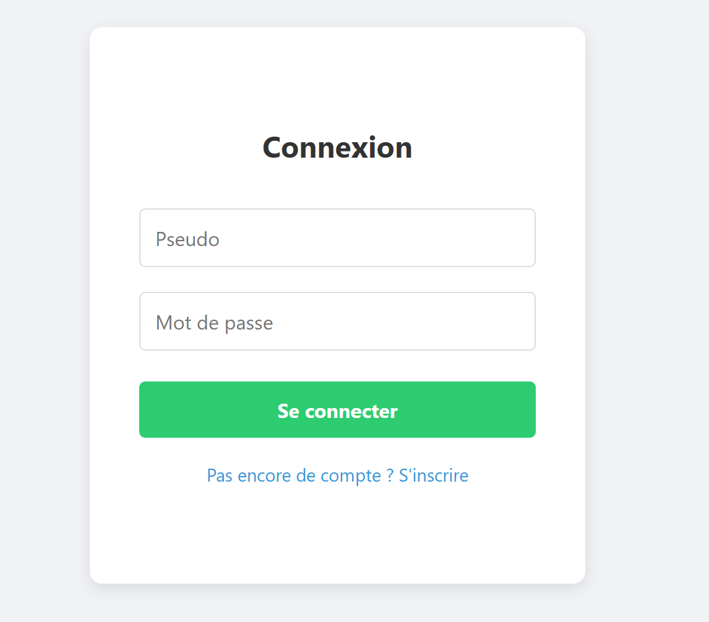
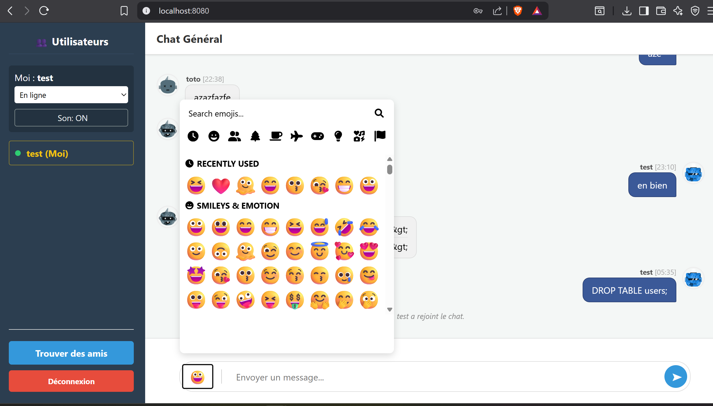
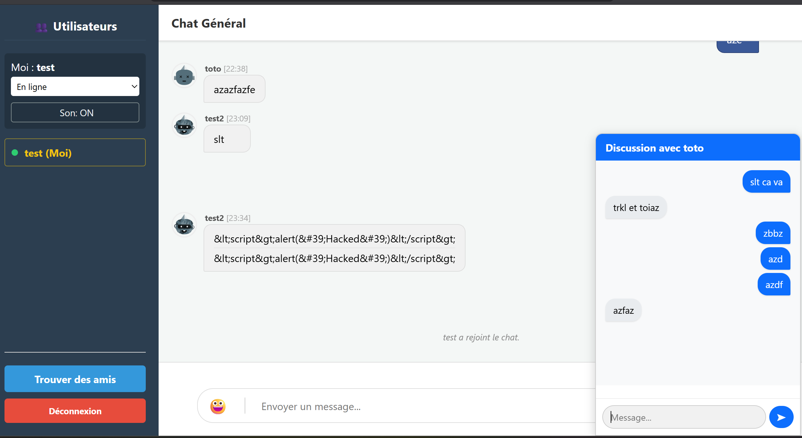
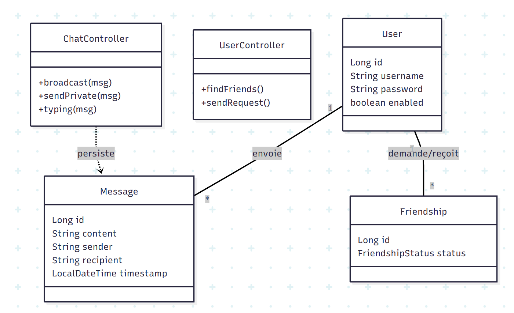
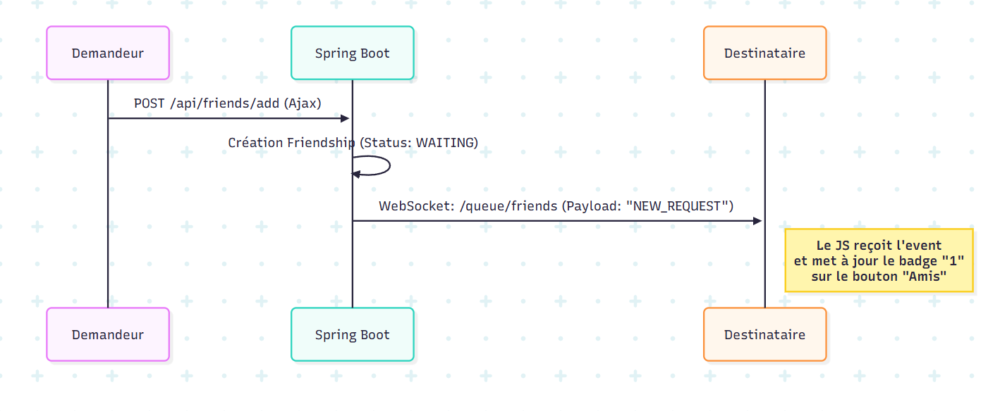
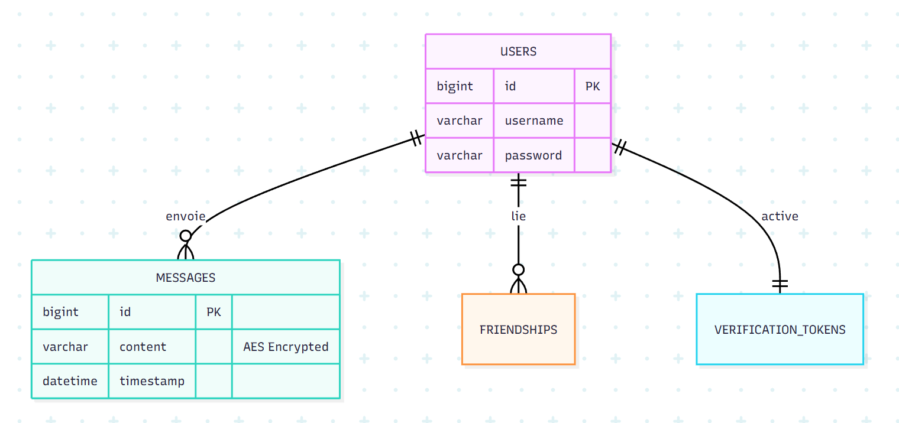

# 💬 ChatApp - Application de Messagerie Temps Réel Sécurisée


## 👥 Auteur
- **Nathan Lyonnet**

---

## 🧭 1. Descriptif Technique et Fonctionnel

Ce projet est une application de chat complète réalisée dans le cadre du **Challenge Technique ESIEA**. Elle a évolué d'un MVP (chat anonyme éphémère) vers une architecture robuste et sécurisée.

### 🌟 Fonctionnalités Avancées

#### 🖥️ Interface & Expérience Utilisateur (UX)
* **Système de Popups Persistantes :**
    * Les conversations privées s'ouvrent dans des **popups** par-dessus l'interface.
    * **Multitâche :** Permet de discuter en privé tout en continuant de suivre le fil du **Chat Général**.
    * **Navigation fluide :** Les popups restent ouvertes même si l'utilisateur navigue entre l'accueil et la page "Trouver des amis".
* **Design Intelligent des Messages :**
    * **Regroupement visuel :** Les messages successifs d'un même utilisateur envoyés à moins de **5 minutes** d'intervalle sont collés pour alléger la lecture. Au-delà, ils sont séparés avec affichage complet (heure, avatar).
    * **Sélecteur d'Emojis 😃 :** Intégré nativement dans la barre de saisie.
    * **Avatars :** Génération automatique d'avatars pour chaque utilisateur.

#### 🔔 Notifications & Alertes
* **Notifications Visuelles :**
    * **Onglet Navigateur :** Le titre de l'onglet clignote ("Nouveau message !") lors de la réception d'un message si l'utilisateur est sur une autre fenêtre.
    * **Badge "Demandes d'amis" :** Une pastille rouge avec le nombre de demandes reçues (ex: "1") apparaît sur le bouton "Trouver des amis".
    * **Badge "Message Privé" :** Une pastille rouge apparaît à côté du pseudo d'un ami dans la liste lorsqu'un message non lu est reçu.
* **Notifications Sonores :**
    * Un son est joué à la réception d'un message.
    * **Toggle ON/OFF :** L'utilisateur peut activer ou désactiver le son via un bouton dédié.

#### 👥 Interactions Sociales
* **Liste des utilisateurs interactive :**
    * Clic sur un ami ➔ Ouvre la **popup de chat privé**.
    * Clic sur un inconnu ➔ Propose d'envoyer une **demande d'ami**.
* **Mentions :** Possibilité d'interpeller un utilisateur dans le chat public via **@user**.
* **Statuts :** En ligne 🟢, Occupé 🔴, Absent 🟠.

#### 🚀 Performance & Optimisation
* **Lazy Loading (Paginé) :** Seuls les **50 derniers messages** sont chargés à la connexion pour éviter toute latence, garantissant une application fluide même avec un historique lourd.
* **MailTrap :** Intégration pour tester l'envoi réel des tokens d'inscription sans spammer de vraies boîtes mail.

#### 🔐 Sécurité & Backend
* **Inscription :** Validation par email via Token unique.
* **Chiffrement :** Mots de passe (BCrypt) et Messages (AES) chiffrés en base.
* **Protection XSS :** Nettoyage des inputs.

## 📸 Démonstration

Voici un aperçu de l'application en action :

| Page de Connexion | Chat Général & Emojis |
| :---: | :---: |
|  |  |

**Le Chat Privé (Multitâche) :**
Ci-dessous, on voit une conversation privée ouverte en popup par-dessus le chat général.


### 🛠️ Stack Technique

| Technologie | Usage |
| :--- | :--- |
| **Java 17 & Spring Boot 3** | Backend, API REST, WebSocket Controller |
| **Spring Security** | Authentification, CSRF, Hachage BCrypt |
| **Spring Data JPA** | Interaction BDD & Convertisseurs AES |
| **MySQL** | Persistance des données (Messages, Users, Relations) |
| **Thymeleaf + JS + Bootstrap** | Frontend & Moteur de template |
| **SockJS & STOMP** | Protocole de communication temps réel |

---

## 📐 2. Analyse et Conception (UML)

Pour concevoir cette application, nous avons modélisé la structure du code, les interactions temps réel et la base de données.

### 🔵 A. Architecture (Diagramme de Classes)
Ce diagramme présente l'architecture MVC de notre backend Spring Boot très globalement. Le **diagramme UML** complet est disponible dans le dossier `/images/`. Il montre comment les **Contrôleurs** (gestion des requêtes) interagissent avec les **Services** (logique métier) et les **Repositories** (accès aux données), ainsi que la structure de nos entités.




---

### 🟠 B. Scénario Temps Réel (Diagramme de Séquence)
Ce diagramme détaille le flux complexe de l'envoi d'un **message privé**. Il illustre la sécurisation (vérification d'amitié), le chiffrement, la persistance en base et la diffusion WebSocket au destinataire spécifique.



---

### 🟢 C. Modèle de Données (ERD / MPD)
Voici la structure relationnelle de notre base de données MySQL. On y voit les relations entre les utilisateurs, leurs messages (avec contenu chiffré), leurs liens d'amitié et les tokens de validation.




## 🧪 3. Tests et Qualité
Le projet inclut des tests automatisés (JUnit 5) pour garantir la sécurité.

### Test Unitaire : Hachage de Mot de Passe
- Classe : `ServiceInscription.java`

- Objectif : Vérifier que les mots de passe ne sont jamais stockés en clair.
- Procédure :
   - Inscription d'un utilisateur avec le mdp "Password123!".

   - Récupération de l'utilisateur en base.
   - Assertion : Le mot de passe stocké doit commencer par $2a$ (signature BCrypt) et ne doit pas être égal à "Password123!".

### Test de Sécurité : Protection XSS

- Classe : `XssTests.java`

- Objectif : Garantir que les scripts malveillants sont neutralisés.

- Procédure :
   - Injection de la chaîne : <script>alert('Hacked')</script>.
   
   - Passage dans le filtre HtmlUtils.
   
   - Assertion : La sortie doit être &lt;script&gt;alert('Hacked')&lt;/script&gt;, rendant le script inoffensif pour le navigateur.

## 🌳 4. Code, Versioning et Git Graph

Nous avons adopté une stratégie de branchement collaborative :
- `main` : Version stable et livrable.

- `feature/*` : Branches dédiées (ex: `feature/private-chat`, `feature/security`, `feature/friendship`).

- Commits : Messages conventionnels (ex: `feat: add encryption`, `fix: websocket disconnect`).


## 📂 Structure du Projet

L'application respecte l'architecture standard de Spring Boot :

```text
src/main/java/com/example/chatapp
├── config/          # Configuration Sécurité & WebSocket
├── controller/      # AuthController, ChatController...
├── model/           # Entités (User, Message, Friendship...)
├── repository/      # Interfaces JPA (UserRepository...)
├── service/         # Logique métier (UserService, EmailService...)
└── ChatAppApplication.java
```

## ⚙️ Installation

1. **Prérequis :** Java 17, Maven, MySQL.

2. **Base de donnnées :** 
```sql
CREATE DATABASE chatapp_db;
```

3. **Configuration :** Editer `src/main/resources/application.properties` :
```properties
spring.datasource.username=root
spring.datasource.password=votre_mot_de_passe
```

4. **Lancement :**
```bash
mvn spring-boot:run
```

5. **Accès :** `http://localhost:8080`

## 🚀 Améliorations Futures

Si j'avais eu plus de temps, voici les fonctionnalités que j'aurai aimé ajouter :
* **🌓 Dark Mode :** Un thème sombre natif pour le confort visuel.
* **✏️ CRUD Messages :** Possibilité de **modifier** et **supprimer** ses propres messages.
* **👀 Statut de lecture :** Indicateur "Vu" (✓✓) quand le destinataire a lu le message.
* **📁 Partage de Médias :** Support du **Drag & Drop** pour envoyer des images et PDF.
* **📢 Salons de Groupe :** Création de "Channels" pour discuter à plusieurs.
* **♾️ Scroll Infini :** Pagination dynamique pour remonter tout l'historique.
* **⬇️ Bouton Scroll :** Une flèche flottante pour redescendre rapidement en bas du chat après avoir lu l'historique.
* **🎨 Profils Personnalisables :** Upload d'avatar, bio et modification de mot de passe.
* **🔍 Recherche avancée :** Filtrer l'historique avec surlignage des termes.
* **🥂 Toasts Système :** Notifications colorées pour les connexions/déconnexions.

---
*2025 - Projet ESIEA - Nathan Lyonnet*